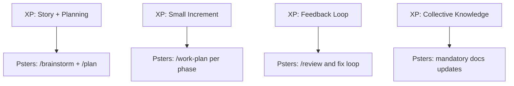

> Source: `docs/english/workflow-methodology.md`

# Psters AI Workflow Methodology

## Positioning

Psters AI Workflow is an **anti-vibe-coding** method for day-to-day software delivery.

It is designed for engineers who want to use AI with professional standards:

- explicit architecture decisions
- implementation traceability
- phased execution
- review and quality loops
- **durable documentation**

It works with any language, framework, and project size.

## Anti-vibe-coding principles

1. **Do not rely on one-shot prompts** for end-to-end delivery.
2. **Make decisions explicit** before implementation.
3. **Separate discovery, planning, execution, review, and documentation** — each has its own step.
4. **Keep scope controlled and observable** — phases, tasks, and checklists.
5. **Use AI as an execution and reasoning partner**, not as an unbounded autopilot.
6. **Contextualize the AI** — always load docs, rules, and patterns before implementation.
7. **Document continuously** — docs are operational memory for future AI and engineers.

## Importance of contextualizing the AI

AI without context produces generic, inconsistent, or wrong code.

**Contextualization means:**

- Reading `docs/solutions/`, `docs/modules/`, `docs/features/`, `docs/lambdas/` before touching code.
- Loading project rules (commits, TypeORM, error capture, user-facing text, etc.).
- Spawning research agents (repo-research-analyst, learnings-researcher) to map existing patterns.
- Using Context7 MCP for library documentation when implementing with external frameworks.

**`/work` and `/work-plan` enforce this:** their first step is always reading documentation. Implementation only starts after research is complete.

## Importance of documentation

Documentation is not a nice-to-have. It is **operational memory** for:

- Future AI runs (so the next agent knows what exists, what is planned, and what invariants apply).
- Future engineers (so they can change code safely without breaking hidden contracts).

**`/work` and `/work-plan` read and update docs as part of the flow:**

- **Read** (Step 1): Load `docs/solutions/patterns/critical-patterns.md`, module/feature/lambda docs, and related solutions.
- **Update** (Step 5): Run doc-shepherd, update module/feature/lambda docs, extract patterns, sync plan checklists.

Every implementation cycle leaves docs in a better state. This compounds over time.

## Operational model

### Workflow diagram

```mermaid
flowchart LR
  A[Idea] --> B[/brainstorm]
  B --> C[/plan]
  C --> D[/work-plan per phase]
  D --> E[/review]
  E --> F[/commit-changes]
  D --> G[/doc and /compound]
  G --> D
```

### 1) `/brainstorm`

Use this step to define:

- what you are building
- why it matters
- where it should live in the codebase
- architecture and constraints
- key open questions and decisions

This is where the implementation skeleton is designed.

### 2) `/plan`

Convert brainstorm output into execution details:

- phases
- concrete tasks
- dependencies
- expected outputs

The plan should be directly executable.

### 3) `/work-plan` (one phase per chat)

Execute one phase at a time in a dedicated chat.
This enforces focus, reduces context confusion, and improves quality.

**Critical:** `/work-plan` reads docs first, executes tasks, then updates docs. No skipping.

### 4) `/review`

Run structured review, identify risks/regressions, fix issues, then re-run review.

### 5) `/work` (outside formal plan)

Use this for small fixes and incremental changes that are not part of a formal plan.

**Critical:** `/work` reads docs first, implements, then updates docs. No skipping.

### 6) `/compound`

Capture solved problems and reusable patterns in documentation.

### 7) `/doc`

Generate or update technical docs by scope (module, feature, architecture, ADR, global update).

Important:

- `/work` and `/work-plan` already update docs as part of their mandatory workflow.
- Use `/doc` and `/compound` when you want to explicitly force a specific documentation output beyond the automatic flow.

### 8) `/deploy-lambda` and `/commit-changes`

- `/deploy-lambda`: guided Lambda deployment workflow
- `/commit-changes`: clean, structured commit generation

## Extreme Programming alignment

The method follows XP in practice:

- Small batches and short feedback loops
- Incremental design and implementation
- Continuous review and refactoring
- Simplicity and communication through docs

### XP similarity map



For a visual explanation with Mermaid diagrams (XP workflow, Psters workflow, and similarity map), see:

- `extreme-programming.md`

## Practical recommendation

If the work is feature-sized, always start with:

`/brainstorm` -> `/plan` -> `/work-plan`

If the work is small and local, use:

`/work` -> `/review` -> `/commit-changes`

**Remember:** Both `/work` and `/work-plan` read and update docs. Documentation is not optional.
