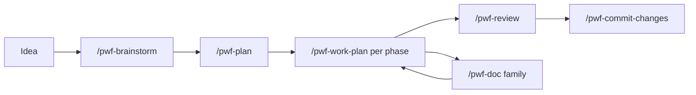
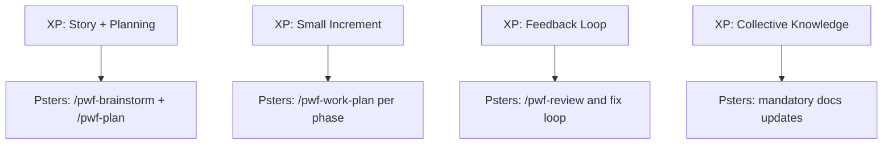

> Source: `docs/english/workflow-methodology.md`

# Psters AI Workflow Methodology

## Culture and Positioning

Psters AI Workflow is an **anti-vibe-coding**, **spec-driven** delivery method for real software teams.

This methodology is inspired by **Spec-Driven Development** and **Extreme Programming (XP)**:

- fast incremental delivery,
- explicit decisions before implementation,
- short feedback loops,
- quality gates when needed,
- mandatory documentation continuity.

The core contract is simple:

- **Control stays with the developer** (choose the path and decisions).
- **Execution stays with AI** (apply the chosen step with rigor).

This method does not ask AI to choose strategy autonomously.  
Predictability is a feature, not a side effect.

It works with any language, framework, and project size.

## Anti-vibe-coding principles

1. **Do not rely on one-shot prompts** for end-to-end delivery.
2. **Make decisions explicit** before implementation.
3. **Separate discovery, planning, execution, review, and documentation** — each has its own step.
4. **Keep scope controlled and observable** — phases, tasks, and checklists.
5. **Use AI as an execution and reasoning partner**, not as an unbounded autopilot.
6. **Contextualize the AI** — always load docs, rules, and patterns before implementation.
7. **Document continuously** — docs are operational memory for future AI and engineers.

## Importance of contextualizing the AI

AI without context produces generic, inconsistent, or wrong code.

**Contextualization means:**

- Reading `docs/solutions/`, `docs/modules/`, `docs/features/`, `docs/lambdas/` before touching code.
- Loading project rules (commits, TypeORM, error capture, user-facing text, etc.).
- Spawning research agents (repo-research-analyst, learnings-researcher) to map existing patterns.
- Using Context7 MCP for library documentation when implementing with external frameworks.

**`/pwf-work` and `/pwf-work-plan` enforce this:** their first step is always reading documentation. Implementation only starts after research is complete.

## Documentation as a cultural rule

Documentation is not a nice-to-have. It is **operational memory** and a **standard-preservation mechanism** for:

- Future AI runs (so the next agent knows what exists, what is planned, and what invariants apply).
- Future engineers (so they can change code safely without breaking hidden contracts).

**`/pwf-work` and `/pwf-work-plan` read and update docs as part of the flow:**

- **Read** (Step 1): Load `docs/solutions/patterns/critical-patterns.md`, module/feature/lambda docs, and related solutions.
- **Update** (Step 5): Run doc-shepherd, update module/feature/lambda docs, extract patterns, sync plan checklists.

Every implementation cycle leaves docs in a better state. This compounds over time and reduces drift.

## Operational model

### Workflow diagram

### 1) `/pwf-brainstorm`

Use this step to define:

- what you are building
- why it matters
- where it should live in the codebase
- architecture and constraints
- key open questions and decisions

This is where the implementation skeleton is designed.

### 2) `/pwf-plan`

Convert brainstorm output into execution details:

- phases
- concrete tasks
- dependencies
- expected outputs

The plan should be directly executable.

### 2.5) Quality gates before execution

Before `/pwf-work-plan`, user may choose to run:

- `/pwf-clarify` to resolve high-impact ambiguities
- `/pwf-checklist` to validate requirements quality by domain
- `/pwf-analyze` to detect cross-artifact consistency gaps

These are explicit user-controlled gates, not mandatory auto-steps.

### 3) `/pwf-work-plan` (one phase per chat)

Execute one phase at a time in a dedicated chat.
This enforces focus, reduces context confusion, and improves quality.

**Critical:** `/pwf-work-plan` reads docs first, executes tasks, then updates docs. No skipping.

### 4) `/pwf-review`

Run structured review, identify risks/regressions, fix issues, then re-run review.

### 5) `/pwf-work` (outside formal plan)

Use this for small fixes and incremental changes that are not part of a formal plan.

**Critical:** `/pwf-work` reads docs first, implements, then updates docs. No skipping.

### 6) `/pwf-doc` family

- `/pwf-doc-capture`: capture solved problems and reusable patterns.
- `/pwf-doc`: generate or update technical docs by scope (module, feature, architecture, ADR, global update).
- `/pwf-doc-foundation`: create or refresh project baseline docs (infrastructure, architecture, integrations, environments, glossary).
- `/pwf-doc-runbook`: create or update operational runbooks under `docs/runbooks/`.

Important:

- `/pwf-work` and `/pwf-work-plan` already update docs as part of their mandatory workflow.
- Use the `/pwf-doc` family when you want to explicitly force a specific documentation output beyond the automatic flow.

### 8) `/pwf-aws-lambda-deploy` and `/pwf-commit-changes`

- `/pwf-aws-lambda-deploy`: guided AWS Lambda deployment workflow
- `/pwf-commit-changes`: clean, structured commit generation

## Extreme Programming alignment

The method follows XP in practice:

- Small batches and short feedback loops
- Incremental design and implementation
- Continuous review and refactoring
- Simplicity and communication through docs

### XP similarity map

For a visual explanation with Mermaid diagrams (XP workflow, Psters workflow, and similarity map), see:

- `extreme-programming.md`

## Choosing the right model for each step

Not every step should use the same model. The most important distinction is between **planning** and **execution**.

### Planning steps — use your most capable model

`/pwf-brainstorm` and `/pwf-plan` are the most critical steps of any feature. They define architecture, constraints, scope, and the full task breakdown. If the plan is weak or incomplete, no amount of execution quality will fix it. Rework at the implementation level is cheap. Rework at the architecture level is expensive.

Use the most capable models available for these steps: Claude Sonnet, Opus, or equivalent high-reasoning models. The difference in plan quality — edge case coverage, integration risk identification, task precision — is substantial.

### Execution steps — a mid-tier model in auto mode is sufficient

`/pwf-work-plan` and `/pwf-work` execute a plan that already exists. The decisions have been made. The architecture has been defined. The agent follows structured instructions, applies project patterns, and updates documentation. A top-tier model is not needed for well-scoped execution tasks.

Mid-tier models in auto mode deliver excellent results at lower latency and significantly lower cost for these steps.

### Review — prefer a capable model

`/pwf-review` spawns multiple specialized agents to audit code, identify regressions, and surface risks. Deep reasoning is required. Use a capable model here.

### Model selection table

| Step | Recommendation |
|------|---------------|
| `/pwf-brainstorm` | High-capability model (Sonnet, Opus, equivalents) |
| `/pwf-plan` | High-capability model — the most critical step |
| `/pwf-work-plan` | Mid-tier model in auto or standard mode |
| `/pwf-work` | Mid-tier model in auto or standard mode |
| `/pwf-review` | High-capability model |
| `/pwf-commit-changes` | Any model |

> Planning is where the feature is won or lost. Invest model quality in the phase that defines the destination. Let execution be efficient.

## Practical recommendation

If the work is feature-sized, start with:

`/pwf-brainstorm` -> `/pwf-plan` -> `[optional by user decision: /pwf-clarify /pwf-checklist /pwf-analyze]` -> `/pwf-work-plan`

Use the quality gates (`/pwf-clarify`, `/pwf-checklist`, `/pwf-analyze`) when you want stronger requirement quality control before execution.

If the work is small and local, use:

`/pwf-work` -> `/pwf-review` -> `/pwf-commit-changes`

**Remember:** Both `/pwf-work` and `/pwf-work-plan` read and update docs. Documentation is not optional.
