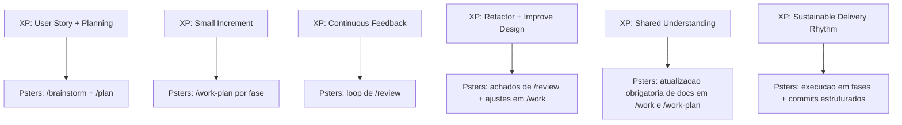

> Source: `docs/portuguese/extreme-programming.md`

# Extreme Programming (XP) e Psters AI Workflow

Este documento explica como o Psters AI Workflow se alinha ao Extreme Programming (XP).

## Por que XP importa aqui

XP e uma disciplina de entrega focada em feedback rapido, incrementos pequenos e melhoria continua.
O Psters AI Workflow aplica a mesma mentalidade com execucao assistida por IA.

## Fluxo classico de XP (simplificado)


## Fluxo Psters AI Workflow

```mermaid
flowchart LR
  A[/brainstorm] --> B[/plan]
  B --> C[/work-plan por fase]
  C --> D[/review]
  D --> E[/commit-changes]
  C --> F[/doc e /compound]
  F --> C
```

## Mapa de similaridade (XP -> Psters)



## Principais diferencas

- XP e mais centrado em praticas de equipe e codigo.
- Psters AI Workflow e mais centrado em orquestracao de IA.
- XP costuma enfatizar TDD de forma explicita; Psters enfatiza contextualizacao, execucao por fases e documentacao como memoria de IA e humanos.

## Aplicacao pratica

Se voce ja trabalha com XP, use o Psters AI Workflow como camada de execucao com IA:

- Mantenha historias pequenas.
- Planeje antes de codar.
- Execute por fases.
- Rode loops de review.
- Atualize documentacao em todo ciclo.

## `/doc` e `/compound` neste fluxo

- `/work-plan` ja atualiza documentacao como parte obrigatoria do fluxo de execucao.
- `/work` tambem atualiza documentacao no proprio fluxo obrigatorio (util para fixes pequenos e ajustes menores fora de plano formal).
- Use `/doc` quando quiser forcar explicitamente atualizacao de documentacao tecnica por escopo.
- Use `/compound` quando quiser forcar explicitamente um artefato de aprendizado (problema/solucao ou padrao reutilizavel).
