# English Wiki

Browse all English documentation pages from this wiki.

## Start Here (Most Important)

- [English: Getting Started](English-Getting-Started)
- [English: Suggested Project Structure](English-Suggested-Project-Structure)
- [English: Workflow Methodology](English-Workflow-Methodology)
- [English: Commands Reference](English-Commands-Reference)
- [English: FAQ](English-Faq)

## Core Workflow References

- [English: Command Recipes](English-Command-Recipes)
- [English: Under The Hood](English-Under-The-Hood)
- [English: Hooks Reference](English-Hooks-Reference)
- [English: Command Naming Convention](English-Command-Naming-Convention)
- [English: Docs Quality Checklist](English-Docs-Quality-Checklist)

## Advanced and Context

- [English: Examples In Practice](English-Examples-In-Practice)
- [English: Extreme Programming](English-Extreme-Programming)
- [English: Cursor Wsl Windows](English-Cursor-Wsl-Windows)
- [English: Other Editors](English-Other-Editors)
- [English: Wiki Sync](English-Wiki-Sync)

## Community and Contribution

- Need help or quick clarification: [Discord](https://discord.gg/vxyrWuqUhe)
- Open an issue for bug reports or deep technical questions: [Repository Issues](https://github.com/J-Pster/Psters_AI_Workflow/issues)
- Contribute improvements: [Pull Requests](https://github.com/J-Pster/Psters_AI_Workflow/pulls)
- Contribution process and standards: [Contributing Guide](Contributing)

## Primary Workflow Diagram

```mermaid
%%{init: {"flowchart": {"curve": "linear", "rankSpacing": 40, "nodeSpacing": 28}} }%%
flowchart LR
  B["/pwf-brainstorm<br/>Define scope and decisions"] --> P["/pwf-plan<br/>Generate phased implementation plan"]
  P --> Q{"Use quality gates?"}
  Q -->|Yes| C["/pwf-checklist<br/>Validate requirement quality"]
  C --> L["/pwf-clarify<br/>Resolve critical ambiguities"]
  L --> A["/pwf-analyze<br/>Run read-only consistency analysis"]
  A --> W["/pwf-work-plan<br/>Implement one phase"]
  Q -->|No| W

  W --> R{"More phases pending?"}
  R -->|Yes| W
  R -->|No| V["/pwf-review<br/>Review and fix findings"]
  V --> M["/pwf-commit-changes<br/>Create structured commits"]

  X["/pwf-work<br/>Fast lane outside formal plan"] -. optional lane .-> V
  D["Docs are central:<br/>/pwf-work and /pwf-work-plan read docs first<br/>and update docs automatically"] -.-> W
  D -.-> X

  classDef core fill:#EEF2FF,stroke:#4F46E5,color:#111827,stroke-width:1.2px;
  classDef quality fill:#ECFDF5,stroke:#059669,color:#111827,stroke-width:1.2px;
  classDef execution fill:#FFF7ED,stroke:#EA580C,color:#111827,stroke-width:1.2px;
  classDef close fill:#F5F3FF,stroke:#7C3AED,color:#111827,stroke-width:1.2px;
  classDef docs fill:#EFF6FF,stroke:#2563EB,color:#111827,stroke-width:1.2px;
  classDef decision fill:#F8FAFC,stroke:#475569,color:#0F172A,stroke-width:1.1px;

  class B,P core;
  class C,L,A quality;
  class W,X execution;
  class V,M close;
  class D docs;
  class Q,R decision;
```

## All Pages

- [English: README](English-README)
- [English: Getting Started](English-Getting-Started)
- [English: Suggested Project Structure](English-Suggested-Project-Structure)
- [English: Workflow Methodology](English-Workflow-Methodology)
- [English: Under The Hood](English-Under-The-Hood)
- [English: Commands Reference](English-Commands-Reference)
- [English: Command Recipes](English-Command-Recipes)
- [English: Examples In Practice](English-Examples-In-Practice)
- [English: Hooks Reference](English-Hooks-Reference)
- [English: Faq](English-Faq)
- [English: Docs Quality Checklist](English-Docs-Quality-Checklist)
- [English: Extreme Programming](English-Extreme-Programming)
- [English: Command Naming Convention](English-Command-Naming-Convention)
- [English: Cursor Wsl Windows](English-Cursor-Wsl-Windows)
- [English: Marketing Workflows](English-Marketing-Workflows)
- [English: Other Editors](English-Other-Editors)
- [English: Wiki Sync](English-Wiki-Sync)

- [Back to Home](Home)
