# Portuguese Wiki (PT-BR)

Navegue por todas as paginas da documentacao em portugues.

## Comece por Aqui (Mais Importante)

- [Começando Agora](Portuguese-Getting-Started)
- [Estrutura de Projeto Sugerida](Portuguese-Suggested-Project-Structure)
- [Metodologia do Workflow](Portuguese-Workflow-Methodology)
- [Referência de Comandos](Portuguese-Commands-Reference)
- [Perguntas Frequentes (FAQ)](Portuguese-Faq)

## Referências Centrais do Workflow

- [Receitas de Comandos](Portuguese-Command-Recipes)
- [Por Dentro do Workflow](Portuguese-Under-The-Hood)
- [Referência de Hooks](Portuguese-Hooks-Reference)
- [Convenção de Nomes de Comandos](Portuguese-Command-Naming-Convention)
- [Checklist de Qualidade da Documentação](Portuguese-Docs-Quality-Checklist)

## Aprofundamento e Contexto

- [Exemplos na Prática](Portuguese-Examples-In-Practice)
- [Extreme Programming (XP)](Portuguese-Extreme-Programming)
- [Cursor no Windows + WSL](Portuguese-Cursor-Wsl-Windows)
- [Outros Editores](Portuguese-Other-Editors)
- [Sincronização com a Wiki](Portuguese-Wiki-Sync)

## Comunidade e Contribuição

- Para dúvidas rápidas e apoio da comunidade: [Discord](https://discord.gg/vxyrWuqUhe)
- Abra uma issue para bugs ou dúvidas técnicas mais profundas: [Issues do Repositório](https://github.com/J-Pster/Psters_AI_Workflow/issues)
- Colabore com melhorias: [Pull Requests](https://github.com/J-Pster/Psters_AI_Workflow/pulls)
- Processo e padrões de contribuição: [Guia de Contribuição](Contributing)

## Diagrama do Workflow Principal

```mermaid
%%{init: {"flowchart": {"curve": "linear", "rankSpacing": 40, "nodeSpacing": 28}} }%%
flowchart LR
  B["/pwf-brainstorm<br/>Definir escopo e decisoes"] --> P["/pwf-plan<br/>Gerar plano de implementacao em fases"]
  P --> Q{"Usar quality gates?"}
  Q -->|Sim| C["/pwf-checklist<br/>Validar qualidade dos requisitos"]
  C --> L["/pwf-clarify<br/>Resolver ambiguidades criticas"]
  L --> A["/pwf-analyze<br/>Analise read-only de consistencia"]
  A --> W["/pwf-work-plan<br/>Implementar uma fase"]
  Q -->|Nao| W

  W --> R{"Ainda existem fases pendentes?"}
  R -->|Sim| W
  R -->|Nao| V["/pwf-review<br/>Revisar e corrigir findings"]
  V --> M["/pwf-commit-changes<br/>Gerar commits estruturados"]

  X["/pwf-work<br/>Faixa rapida fora do plano formal"] -. caminho opcional .-> V
  D["Docs sao centrais:<br/>/pwf-work e /pwf-work-plan leem docs antes<br/>e atualizam docs automaticamente"] -.-> W
  D -.-> X

  classDef core fill:#EEF2FF,stroke:#4F46E5,color:#111827,stroke-width:1.2px;
  classDef quality fill:#ECFDF5,stroke:#059669,color:#111827,stroke-width:1.2px;
  classDef execution fill:#FFF7ED,stroke:#EA580C,color:#111827,stroke-width:1.2px;
  classDef close fill:#F5F3FF,stroke:#7C3AED,color:#111827,stroke-width:1.2px;
  classDef docs fill:#EFF6FF,stroke:#2563EB,color:#111827,stroke-width:1.2px;
  classDef decision fill:#F8FAFC,stroke:#475569,color:#0F172A,stroke-width:1.1px;

  class B,P core;
  class C,L,A quality;
  class W,X execution;
  class V,M close;
  class D docs;
  class Q,R decision;
```

## Todas as Páginas

- [Início](Portuguese-README)
- [Começando Agora](Portuguese-Getting-Started)
- [Estrutura de Projeto Sugerida](Portuguese-Suggested-Project-Structure)
- [Metodologia do Workflow](Portuguese-Workflow-Methodology)
- [Por Dentro do Workflow](Portuguese-Under-The-Hood)
- [Referência de Comandos](Portuguese-Commands-Reference)
- [Receitas de Comandos](Portuguese-Command-Recipes)
- [Exemplos na Prática](Portuguese-Examples-In-Practice)
- [Referência de Hooks](Portuguese-Hooks-Reference)
- [Perguntas Frequentes (FAQ)](Portuguese-Faq)
- [Checklist de Qualidade da Documentação](Portuguese-Docs-Quality-Checklist)
- [Extreme Programming (XP)](Portuguese-Extreme-Programming)
- [Convenção de Nomes de Comandos](Portuguese-Command-Naming-Convention)
- [Cursor no Windows + WSL](Portuguese-Cursor-Wsl-Windows)
- [Workflows de Marketing](Portuguese-Marketing-Workflows)
- [Outros Editores](Portuguese-Other-Editors)
- [Sincronização com a Wiki](Portuguese-Wiki-Sync)

- [Voltar para Home](Home)
