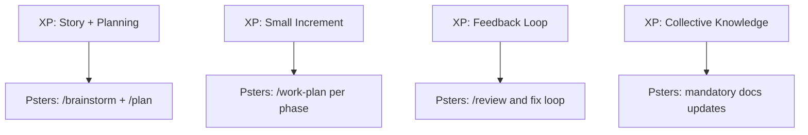
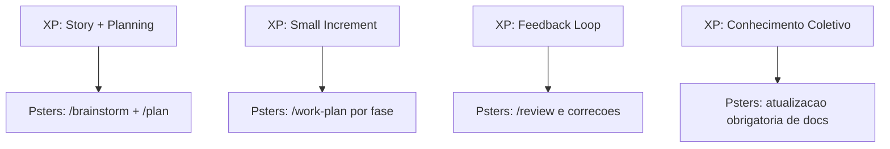

<h1>
  
  Psters AI Workflow
</h1>

An anti-vibe-coding, agentic workflow to use AI with engineering rigor in any project.

## Psters AI Workflow Explained (START HERE)

- English: [jump to English section](#psters-ai-workflow-explained-english)
- Portuguese (PT-BR): [jump to Portuguese section](#psters-ai-workflow-explicado-portugues-pt-br)

## Community

- Discord: [Pster's AI Workflow Discord](https://discord.gg/vxyrWuqUhe)

## GitHub Wiki Sync

This repository is structured to sync `docs/` into the GitHub Wiki automatically.

1. In GitHub, open `Settings` -> `Features` and enable `Wikis`.
2. Go to `Actions` and run workflow: **Sync Docs to Wiki**.
3. Open the Wiki tab to see `Home`, sidebar navigation, and all docs pages.

Whenever `docs/` changes on `main`, the workflow syncs pages to the Wiki again.

## Documentation Navigation

- Docs index (start here): [docs/README.md](docs/README.md)
- English docs index: [docs/english/README.md](docs/english/README.md)
- Portuguese docs index: [docs/portuguese/README.md](docs/portuguese/README.md)

### English docs

- [Getting started](docs/english/getting-started.md)
- [Workflow methodology](docs/english/workflow-methodology.md)
- [Commands reference](docs/english/commands-reference.md)
- [Command recipes](docs/english/command-recipes.md)
- [Examples in practice](docs/english/examples-in-practice.md)
- [Hooks reference](docs/english/hooks-reference.md)
- [FAQ](docs/english/faq.md)
- [Docs quality checklist](docs/english/docs-quality-checklist.md)
- [Add a plugin](docs/english/add-a-plugin.md)

### Portuguese docs

- [Comece em 10 minutos](docs/portuguese/getting-started.md)
- [Metodologia do workflow](docs/portuguese/workflow-methodology.md)
- [Referencia de comandos](docs/portuguese/commands-reference.md)
- [Receitas de comandos](docs/portuguese/command-recipes.md)
- [Exemplos na pratica](docs/portuguese/examples-in-practice.md)
- [Referencia de hooks](docs/portuguese/hooks-reference.md)
- [FAQ](docs/portuguese/faq.md)
- [Checklist de qualidade de documentacao](docs/portuguese/docs-quality-checklist.md)
- [Adicionar plugin](docs/portuguese/add-a-plugin.md)

## Quick map

- [Core philosophy](#core-philosophy)
- [Method in one diagram](#method-in-one-diagram)
- [Quick adoption steps](#quick-adoption-steps)
- [Workflow commands](#workflow-commands)
- [Hooks (automation guardrails)](#hooks-automation-guardrails)
- [Extreme Programming alignment](#extreme-programming-alignment)

---

## Contribute and Expand

This plugin is open to anyone who wants to suggest, expand, and improve it for all developers.

- Want to add new agents?
- Want to add or improve commands?
- Want language-specific workflow expansions?

You can contribute in two ways:

- **Idea-only contribution**: open an issue in this GitHub repository and describe your idea. If you do not want to implement it yourself, someone from the community can pick it up.
- **Code contribution**: open an issue and submit a pull request. We review and discuss everything on GitHub.

Everyone who contributes meaningfully will be recognized as a contributor in this project.

Contribution guide: [CONTRIBUTING.md](CONTRIBUTING.md)

---

## Psters AI Workflow Explained (English)

`psters-ai-workflow` is an agentic workflow for using AI like a professional software engineer.

This is an **anti-vibe-coding** workflow.
It is not about one-shot prompts, random generation, or "let AI do everything without design".
It is about engineering discipline: clear decisions, explicit architecture, phased execution, and structured review.

This workflow is language-agnostic and framework-agnostic. You can use it in any codebase.

### Why this exists

AI usage in software development became mainstream, but a large part of the market moved toward "vibe coding".
This project goes in the opposite direction:

- You define the architecture and constraints.
- AI helps you reason, plan, execute, and review.
- Work is broken into steps with traceability.
- Quality gates and documentation are part of the flow.

This workflow was built from real daily usage in a production startup environment over multiple weeks, with continuous feature delivery.

### Anti-vibe coding

**Vibe coding** = one-shot prompts, minimal context, hope for the best. It produces brittle, inconsistent, and hard-to-maintain code.

**Anti-vibe coding** = contextualize the AI, document continuously, and enforce structure:

1. **Contextualize the AI** — Before implementation, the AI must read existing docs (`docs/solutions/`, `docs/modules/`, `docs/features/`, `docs/lambdas/`), rules, and patterns. `/work` and `/work-plan` enforce this: their first step is always reading documentation, never editing code.
2. **Document continuously** — Documentation is operational memory for future AI and engineers. Every implementation cycle updates docs. `/work` and `/work-plan` both read and update docs as part of their mandatory workflow (Step 5: Documentation Maintenance).
3. **Enforce structure** — Phases, tasks, review loops, and commit conventions keep work traceable and reviewable.

### Install the plugin

### Option 1: Cursor Marketplace

When published, install from [Cursor Marketplace](https://cursor.com/marketplace).

### Option 2: Manual install (available now)

1. Run:
   - `./scripts/install-plugin-local.sh`
2. Restart Cursor (or reload the window).

After install, confirm the plugin appears in Cursor Plugins and commands are available.

### Core philosophy

Do not run one giant prompt and hope for the best.

Use this sequence instead:

1. Define intent and constraints.
2. Explore trade-offs.
3. Produce an implementation plan.
4. Execute in controlled phases.
5. Review and fix.
6. Document and commit with quality.

In short: **you define the "how"; AI executes with rigor**.

### Method in one diagram

```mermaid
flowchart LR
  A[Idea] --> B[/brainstorm]
  B --> C[/plan]
  C --> D[/work-plan per phase]
  D --> E[/review]
  E --> F[/commit-changes]
  D --> G[/doc and /compound]
  G --> D
```

### Quick adoption steps

1. Start every feature with `/brainstorm`.
2. Convert decisions to phases using `/plan`.
3. Execute one phase per chat using `/work-plan`.
4. Use `/work` for small fixes, minor adjustments, and follow-up changes outside a formal plan.
5. Run `/review`, fix issues, and re-run review.
6. Use `/doc` and `/compound` when you want to force specific documentation output.

> Tip: `/work-plan` is the default for phased implementation, while `/work` is the fast lane for smaller scoped changes.

### Workflow commands

Recommended flow:

`/brainstorm` -> `/plan` -> `/work-plan` (per phase) -> `/review` -> `/commit-changes`

Command overview:

- `/brainstorm`: shape the feature idea, constraints, architecture, and decisions.
- `/plan`: convert brainstorm decisions into phased, executable tasks.
- `/work-plan`: execute one phase at a time (new chat per phase recommended). **Reads and updates docs** as part of the flow.
- `/review`: run structured review, fix findings, and re-run review.
- `/work`: execute non-plan tasks (small fixes, follow-up adjustments). **Reads and updates docs** as part of the flow.
- `/compound`: capture reusable learnings/patterns as docs.
- `/doc`: generate or refresh technical docs (module, feature, architecture, ADR, updates).
- `/deploy-lambda`: deploy Lambda functions with script-driven workflow.
- `/commit-changes`: create well-structured commits from implemented work.

`/doc` vs `/compound`:

- `/work` and `/work-plan` already perform mandatory documentation updates inside their own execution flow.
- `/doc` is used when you want to explicitly force documentation generation/update for a specific scope.
- `/compound` is used when you want to explicitly force a learning artifact (problem/solution or reusable pattern).

> Important: use `/doc` to describe the current system state; use `/compound` to preserve reusable learning.

### Documentation as first-class citizen

`/work` and `/work-plan` treat documentation as mandatory:

- **Step 1**: Read existing docs before any code change.
- **Step 5**: Update docs after implementation (doc-shepherd, module/feature/lambda docs, pattern extraction).
- **Quality gate**: Docs must pass specificity, state clarity, operational usefulness, and consistency checks.

This keeps `docs/` accurate and useful for future AI runs and human engineers.

### Hooks (automation guardrails)

The plugin also uses hooks to reinforce the workflow:

- track code vs docs edits during a session
- remind documentation update when code changed without doc updates
- remind commit message convention before `git commit`
- remind TypeORM migration atomic chain after `typeorm:generate`

These hooks do not replace commands like `/work`, `/work-plan`, `/doc`, and `/compound`; they enforce them.

### Extreme Programming alignment

This workflow is heavily aligned with XP principles:

- **Small batches**: phased implementation instead of big-bang changes.
- **Fast feedback**: review loop and iterative correction.
- **Collective code ownership**: explicit documentation and traceable decisions.
- **Continuous integration mindset**: validate often, not only at the end.
- **Simplicity first**: avoid speculative complexity and keep scope explicit.



### Documentation map

- `docs/english/getting-started.md`: first-run guide in 10 minutes (EN).
- `docs/english/workflow-methodology.md`: full methodology (EN).
- `docs/english/commands-reference.md`: command-by-command usage guide (EN).
- `docs/english/command-recipes.md`: practical command sequences by scenario (EN).
- `docs/english/examples-in-practice.md`: realistic workflow examples (EN).
- `docs/english/hooks-reference.md`: hook events and behaviors (EN).
- `docs/english/faq.md`: common questions and usage decisions (EN).
- `docs/english/docs-quality-checklist.md`: quality checklist before docs merge (EN).
- `docs/english/wiki-sync.md`: how to publish docs to GitHub Wiki (EN).
- `docs/english/add-a-plugin.md`: plugin extension instructions (EN).
- `docs/english/`: English documentation set.
- `docs/portuguese/`: Portuguese documentation set.

### Repository notes

This repository currently maintains one plugin:

- `plugins/psters-ai-workflow`

Validation command:

- `node scripts/validate-template.mjs`

---

<a id="psters-ai-workflow-explicado-portugues-pt-br"></a>

## Psters AI Workflow Explicado (Português - PT-BR)

`psters-ai-workflow` e um workflow agêntico para usar IA como engenheiro de software profissional.

Este e um workflow **anti-vibe-coding**.
Nao e sobre one-shot prompt, geracao aleatoria, ou "deixar a IA fazer tudo sem desenho".
E sobre disciplina de engenharia: decisoes claras, arquitetura explicita, execucao em fases e revisao estruturada.

Ele e agnostico de linguagem e framework. Voce pode usar em qualquer codebase.

### Por que isso existe

O uso de IA no desenvolvimento ficou mainstream, mas muita gente caiu no "vibe coding".
Este projeto segue no sentido oposto:

- Voce define arquitetura e restricoes.
- A IA ajuda a raciocinar, planejar, executar e revisar.
- O trabalho e quebrado em etapas com rastreabilidade.
- Qualidade e documentacao fazem parte do fluxo.

Este workflow nasceu de uso real diario em ambiente de startup com entrega continua de funcionalidades.

### Anti-vibe coding

**Vibe coding** = prompt unico, pouco contexto, torcer para dar certo. Resultado: codigo fragil, inconsistente e dificil de manter.

**Anti-vibe coding** = contextualizar IA, documentar continuamente e impor estrutura:

1. **Contextualize a IA** — Antes de implementar, a IA precisa ler docs existentes (`docs/solutions/`, `docs/modules/`, `docs/features/`, `docs/lambdas/`), regras e padroes. `/work` e `/work-plan` forcam isso: primeiro passo e leitura de docs, nunca edicao direta de codigo.
2. **Documente continuamente** — Documentacao e memoria operacional para futuras execucoes de IA e para engenharia. Todo ciclo de implementacao atualiza docs. `/work` e `/work-plan` leem e atualizam docs como etapa obrigatoria.
3. **Imponha estrutura** — fases, tarefas, loops de review e padrao de commit mantem o trabalho rastreavel.

### Instalar o plugin

### Opcao 1: Cursor Marketplace

Quando publicado, instale via [Cursor Marketplace](https://cursor.com/marketplace).

### Opcao 2: Instalacao manual (disponivel agora)

1. Rode:
   - `./scripts/install-plugin-local.sh`
2. Reinicie o Cursor (ou recarregue a janela).

Depois da instalacao, confirme que o plugin aparece na lista de Plugins do Cursor e que os comandos estao disponiveis.

### Filosofia central

Nao rode um prompt gigante e torca pelo melhor.

Use esta sequencia:

1. Definir intencao e restricoes.
2. Explorar trade-offs.
3. Produzir um plano de implementacao.
4. Executar em fases controladas.
5. Revisar e corrigir.
6. Documentar e commitar com qualidade.

Em resumo: **voce define o "como"; a IA executa com rigor**.

### Metodo em um diagrama

```mermaid
flowchart LR
  A[Ideia] --> B[/brainstorm]
  B --> C[/plan]
  C --> D[/work-plan por fase]
  D --> E[/review]
  E --> F[/commit-changes]
  D --> G[/doc e /compound]
  G --> D
```

### Passo a passo de adocao

1. Comece toda feature com `/brainstorm`.
2. Converta decisoes em fases com `/plan`.
3. Execute uma fase por chat com `/work-plan`.
4. Use `/work` para fixes pequenos, ajustes menores e mudancas fora de plano formal.
5. Rode `/review`, corrija pendencias e rode de novo.
6. Use `/doc` e `/compound` quando quiser forcar uma saida de documentacao especifica.

> Dica: `/work-plan` e o caminho padrao para implementacao em fases, enquanto `/work` e o caminho rapido para mudancas menores.

### Comandos do workflow

Fluxo recomendado:

`/brainstorm` -> `/plan` -> `/work-plan` (por fase) -> `/review` -> `/commit-changes`

Visao geral:

- `/brainstorm`: desenha ideia, restricoes, arquitetura e decisoes.
- `/plan`: converte decisoes em tarefas executaveis por fases.
- `/work-plan`: executa uma fase por vez (ideal em chat novo). **Le e atualiza docs** no fluxo.
- `/review`: roda revisao estruturada, corrige pendencias e roda de novo.
- `/work`: executa tarefas fora de plano formal. **Le e atualiza docs** no fluxo.
- `/compound`: captura aprendizados e padroes reutilizaveis.
- `/doc`: gera/atualiza docs tecnicas (modulo, feature, arquitetura, ADR, update).
- `/deploy-lambda`: deploy de Lambda guiado por script.
- `/commit-changes`: cria commits bem estruturados.

`/doc` vs `/compound`:

- `/work` e `/work-plan` ja atualizam documentacao de forma obrigatoria dentro do fluxo de execucao.
- `/doc` e para quando voce quer forcar geracao/atualizacao de documentacao tecnica de um escopo especifico.
- `/compound` e para quando voce quer forcar registro de aprendizado (problema/solucao ou padrao reutilizavel).

> Importante: use `/doc` para descrever o estado atual do sistema; use `/compound` para preservar aprendizado reutilizavel.

### Documentacao como parte obrigatoria

`/work` e `/work-plan` tratam documentacao como obrigatoria:

- **Step 1**: ler docs antes de qualquer mudanca de codigo.
- **Step 5/4**: atualizar docs depois da implementacao (doc-shepherd, docs de modulo/feature/lambda, extracao de padrao).
- **Quality gate**: docs precisam passar criterios de especificidade, clareza de estado, utilidade operacional e consistencia.

Isso mantem `docs/` util para futuras execucoes de IA e para humanos.

### Hooks (guardrails de automacao)

O plugin tambem usa hooks para reforcar o workflow:

- rastreia edicoes de codigo vs docs por sessao
- lembra atualizacao de docs quando codigo muda sem documentacao
- lembra convencao de commit antes de `git commit`
- lembra cadeia atomica de migration apos `typeorm:generate`

Hooks nao substituem `/work`, `/work-plan`, `/doc` e `/compound`; eles reforcam esses comandos.

### Alinhamento com Extreme Programming (XP)

Este workflow segue principios de XP:

- **Lotes pequenos**: implementacao em fases, sem big bang.
- **Feedback rapido**: loop de review e correcao iterativa.
- **Code ownership coletivo**: documentacao explicita e decisoes rastreaveis.
- **Mentalidade de integracao continua**: validar ao longo do fluxo, nao so no fim.
- **Simplicidade primeiro**: evitar complexidade especulativa.



### Mapa de documentacao

- `docs/portuguese/getting-started.md`: guia de primeira execucao em 10 minutos (PT-BR).
- `docs/portuguese/workflow-methodology.md`: metodologia completa (PT-BR).
- `docs/portuguese/commands-reference.md`: guia detalhado por comando (PT-BR).
- `docs/portuguese/command-recipes.md`: sequencias praticas de comandos por cenario (PT-BR).
- `docs/portuguese/examples-in-practice.md`: exemplos realistas de execucao do workflow (PT-BR).
- `docs/portuguese/hooks-reference.md`: eventos e comportamentos dos hooks (PT-BR).
- `docs/portuguese/faq.md`: duvidas comuns e decisoes de uso (PT-BR).
- `docs/portuguese/docs-quality-checklist.md`: checklist de qualidade antes de merge de docs (PT-BR).
- `docs/portuguese/wiki-sync.md`: como publicar docs na GitHub Wiki (PT-BR).
- `docs/portuguese/add-a-plugin.md`: instrucoes para extensao de plugin (PT-BR).
- `docs/english/`: conjunto de documentacao em ingles.
- `docs/portuguese/`: conjunto de documentacao em portugues.

### Notas do repositorio

Este repositorio atualmente mantem um plugin:

- `plugins/psters-ai-workflow`

Comando de validacao:

- `node scripts/validate-template.mjs`
