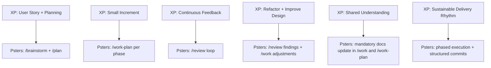

# Extreme Programming (XP) and Psters AI Workflow

This document explains how the Psters AI Workflow aligns with Extreme Programming (XP).

## Why XP matters here

XP is a delivery discipline focused on fast feedback, small increments, and continuous improvement.
The Psters AI Workflow applies the same mindset with AI-assisted execution.

## Classic XP workflow (simplified)


## Psters AI Workflow

```mermaid
flowchart LR
  A[/brainstorm] --> B[/plan]
  B --> C[/work-plan per phase]
  C --> D[/review]
  D --> E[/commit-changes]
  C --> F[/doc and /compound]
  F --> C
```

## Similarity map (XP -> Psters)



## Key differences

- XP is team- and code-practice centered.
- Psters AI Workflow is AI-orchestration centered.
- XP usually emphasizes TDD explicitly; Psters emphasizes contextualization, phased execution, and documentation-first memory for AI and humans.

## Practical takeaway

If you already work with XP, adopt Psters AI Workflow as your AI execution layer:

- Keep stories small.
- Plan before coding.
- Execute in phases.
- Run review loops.
- Update docs every cycle.

## `/doc` and `/compound` in this flow

- `/work-plan` already updates documentation as part of its mandatory execution flow.
- `/work` also updates documentation in its own mandatory flow (useful for small fixes and minor adjustments outside a formal plan).
- Use `/doc` when you want to explicitly force technical documentation updates by scope.
- Use `/compound` when you want to explicitly force a learning artifact (problem/solution or reusable pattern).
