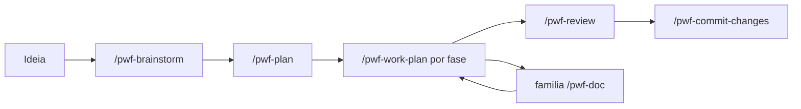
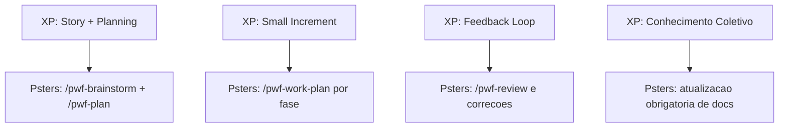

# Metodologia Psters AI Workflow

## Cultura e Posicionamento

O Psters AI Workflow e um metodo **anti-vibe-coding** e **spec-driven** para times reais de software.

Essa metodologia segue **Spec-Driven Development** e se inspira em **Extreme Programming (XP)**:

- entrega incremental rapida,
- decisoes explicitas antes de implementar,
- ciclos curtos de feedback,
- quality gates quando necessario,
- continuidade obrigatoria de documentacao.

O contrato central e simples:

- **O controle fica com o desenvolvedor** (ele escolhe caminho e decisoes).
- **A execucao fica com a IA** (ela aplica a etapa escolhida com rigor).

Aqui a IA nao decide sozinha a estrategia de execucao.  
Previsibilidade e uma feature do metodo.

Funciona com qualquer linguagem, framework e tamanho de projeto.

## Principios anti-vibe-coding

1. **Nao dependa de prompts one-shot** para entrega end-to-end.
2. **Torne as decisoes explicitas** antes da implementacao.
3. **Separe descoberta, planejamento, execucao, revisao e documentacao** — cada etapa tem seu papel.
4. **Mantenha escopo controlado e observavel** — fases, tarefas e checklists.
5. **Use IA como parceira de execucao e raciocinio**, nao como piloto automatico sem limites.
6. **Contextualize a IA** — sempre carregue docs, regras e padroes antes de implementar.
7. **Documente continuamente** — docs sao memoria operacional para futuras execucoes de IA e para engenharia.

## Importancia de contextualizar a IA

IA sem contexto tende a produzir codigo generico, inconsistente ou incorreto.

**Contextualizar significa:**

- Ler `docs/solutions/`, `docs/modules/`, `docs/features/`, `docs/lambdas/` antes de tocar no codigo.
- Carregar regras do projeto (commits, TypeORM, captura de erro, user-facing text etc.).
- Disparar agentes de pesquisa (repo-research-analyst, learnings-researcher) para mapear padroes existentes.
- Usar Context7 MCP para documentacao de bibliotecas/frameworks externos.

**`/pwf-work` e `/pwf-work-plan` forcam isso:** o primeiro passo sempre e leitura de documentacao. Implementacao so comeca depois da pesquisa.

## Documentacao como regra cultural

Documentacao nao e opcional. Ela e **memoria operacional** e **mecanismo de preservacao de padrao** para:

- Futuras execucoes de IA (saber o que existe, o que esta planejado e quais invariantes se aplicam).
- Futuros desenvolvedores (alterar com seguranca sem quebrar contratos ocultos).

**`/pwf-work` e `/pwf-work-plan` leem e atualizam docs como parte do fluxo:**

- **Leitura** (Step 1): carrega `docs/solutions/patterns/critical-patterns.md`, docs de modulo/feature/lambda e solucoes relacionadas.
- **Atualizacao** (Step 5): executa doc-shepherd, atualiza docs de modulo/feature/lambda, extrai padroes e sincroniza checklist de plano.

Cada ciclo de implementacao deixa as docs melhores. Isso acumula ao longo do tempo e reduz drift.

## Modelo operacional

### Diagrama do workflow

### 1) `/pwf-brainstorm`

Use para definir:

- o que voce vai construir
- por que isso importa
- onde isso deve ficar no codebase
- arquitetura e restricoes
- principais perguntas e decisoes

Aqui nasce o esqueleto da implementacao.

### 2) `/pwf-plan`

Converta o brainstorm em execucao:

- fases
- tarefas concretas
- dependencias
- resultados esperados

O plano deve ser diretamente executavel.

### 2.5) Quality gates antes da execucao

Antes do `/pwf-work-plan`, o usuario pode optar por rodar:

- `/pwf-clarify` para resolver ambiguidades de alto impacto
- `/pwf-checklist` para validar qualidade de requisitos por dominio
- `/pwf-analyze` para detectar gaps de consistencia entre artefatos

Esses gates sao controlados explicitamente pelo usuario, nao passos automaticos obrigatorios.

### 3) `/pwf-work-plan` (uma fase por chat)

Execute uma fase por vez em um chat dedicado.
Isso aumenta foco, reduz confusao de contexto e melhora qualidade.

**Critico:** `/pwf-work-plan` le docs primeiro, executa tarefas e depois atualiza docs. Sem pular etapas.

### 4) `/pwf-review`

Rode revisao estruturada, identifique riscos/regressoes, corrija e rode de novo.

### 5) `/pwf-work` (fora de plano formal)

Use para fixes pequenos e incrementos que nao exigem plano completo.

**Critico:** `/pwf-work` le docs primeiro, implementa e depois atualiza docs. Sem pular etapas.

### 6) Familia `/pwf-doc`

- `/pwf-doc-capture`: capture problemas resolvidos e padroes reutilizaveis.
- `/pwf-doc`: gere ou atualize documentacao tecnica por escopo (modulo, feature, arquitetura, ADR, update global).
- `/pwf-doc-foundation`: crie ou atualize docs base do projeto (infrastructure, architecture, integrations, environments, glossary).
- `/pwf-doc-runbook`: crie ou atualize runbooks operacionais em `docs/runbooks/`.

Importante:

- `/pwf-work` e `/pwf-work-plan` ja atualizam docs como parte obrigatoria do fluxo.
- Use a familia `/pwf-doc` quando quiser forcar uma saida de documentacao especifica alem do fluxo automatico.

### 8) `/pwf-aws-lambda-deploy` e `/pwf-commit-changes`

- `/pwf-aws-lambda-deploy`: fluxo guiado de deploy de AWS Lambda
- `/pwf-commit-changes`: commits limpos e estruturados

## Alinhamento com Extreme Programming (XP)

O metodo segue XP na pratica:

- lotes pequenos e feedback rapido
- design e implementacao incrementais
- revisao e refatoracao continuas
- simplicidade e comunicacao via documentacao

### Mapa de similaridade com XP

Para uma explicacao visual com diagramas Mermaid (fluxo XP, fluxo Psters e mapa de similaridade), veja:

- `extreme-programming.md`

## Escolhendo o modelo certo para cada etapa

Nem toda etapa deve usar o mesmo modelo. A distincao mais importante e entre **planejamento** e **execucao**.

### Etapas de planejamento — use o modelo mais capaz disponivel

`/pwf-brainstorm` e `/pwf-plan` sao as etapas mais criticas de qualquer feature. Elas definem arquitetura, restricoes, escopo e o detalhamento completo de tarefas. Se o plano estiver fraco ou incompleto, nenhuma qualidade de execucao vai corrigir isso. Retrabalho de implementacao e barato. Retrabalho de arquitetura e caro.

Use os modelos mais capazes disponiveis nessas etapas: Claude Sonnet, Opus ou equivalentes de alto raciocinio. A diferenca na qualidade do plano — cobertura de edge cases, identificacao de risco de integracao, precisao de tarefas — e substancial.

### Etapas de execucao — modelo intermediario em modo auto e suficiente

`/pwf-work-plan` e `/pwf-work` executam um plano que ja existe. As decisoes foram tomadas. A arquitetura foi definida. O agente segue instrucoes estruturadas, aplica padroes do projeto e atualiza documentacao. Modelo de ponta nao e necessario para tarefas de execucao bem definidas.

Modelos intermediarios em modo auto entregam excelente resultado com latencia menor e custo significativamente inferior nessas etapas.

### Revisao — prefira modelo mais capaz

`/pwf-review` dispara multiplos agentes especializados para auditar codigo, identificar regressoes e levantar riscos. Raciocinio profundo e necessario. Use modelo mais capaz aqui.

### Tabela de selecao de modelo

| Etapa | Recomendacao |
|-------|-------------|
| `/pwf-brainstorm` | Modelo de alta capacidade (Sonnet, Opus, equivalentes) |
| `/pwf-plan` | Modelo de alta capacidade — etapa mais critica |
| `/pwf-work-plan` | Modelo intermediario em auto ou modo padrao |
| `/pwf-work` | Modelo intermediario em auto ou modo padrao |
| `/pwf-review` | Modelo de alta capacidade |
| `/pwf-commit-changes` | Qualquer modelo |

> O planejamento e onde a feature e ganha ou perdida. Invista capacidade do modelo na etapa que define o destino. Deixe a execucao ser eficiente.

## Recomendacao pratica

Se o trabalho e de feature, comece por:

`/pwf-brainstorm` -> `/pwf-plan` -> `[opcional por decisao do usuario: /pwf-clarify /pwf-checklist /pwf-analyze]` -> `/pwf-work-plan`

Use os quality gates (`/pwf-clarify`, `/pwf-checklist`, `/pwf-analyze`) quando voce quiser um controle mais forte da qualidade de requisitos antes da execucao.

Se o trabalho e pequeno e local:

`/pwf-work` -> `/pwf-review` -> `/pwf-commit-changes`

**Lembrete:** `/pwf-work` e `/pwf-work-plan` leem e atualizam docs. Documentacao e obrigatoria.
