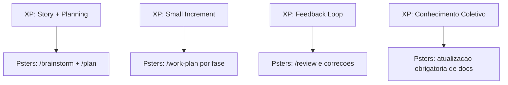

# Metodologia Psters AI Workflow

## Posicionamento

O Psters AI Workflow e um metodo **anti-vibe-coding** para entrega de software no dia a dia.

Ele foi desenhado para desenvolvedores que querem usar IA com padrao profissional:

- decisoes explicitas de arquitetura
- rastreabilidade de implementacao
- execucao em fases
- loops de revisao e qualidade
- **documentacao duravel**

Funciona com qualquer linguagem, framework e tamanho de projeto.

## Principios anti-vibe-coding

1. **Nao dependa de prompts one-shot** para entrega end-to-end.
2. **Torne as decisoes explicitas** antes da implementacao.
3. **Separe descoberta, planejamento, execucao, revisao e documentacao** — cada etapa tem seu papel.
4. **Mantenha escopo controlado e observavel** — fases, tarefas e checklists.
5. **Use IA como parceira de execucao e raciocinio**, nao como piloto automatico sem limites.
6. **Contextualize a IA** — sempre carregue docs, regras e padroes antes de implementar.
7. **Documente continuamente** — docs sao memoria operacional para futuras execucoes de IA e para engenharia.

## Importancia de contextualizar a IA

IA sem contexto tende a produzir codigo generico, inconsistente ou incorreto.

**Contextualizar significa:**

- Ler `docs/solutions/`, `docs/modules/`, `docs/features/`, `docs/lambdas/` antes de tocar no codigo.
- Carregar regras do projeto (commits, TypeORM, captura de erro, user-facing text etc.).
- Disparar agentes de pesquisa (repo-research-analyst, learnings-researcher) para mapear padroes existentes.
- Usar Context7 MCP para documentacao de bibliotecas/frameworks externos.

**`/work` e `/work-plan` forcam isso:** o primeiro passo sempre e leitura de documentacao. Implementacao so comeca depois da pesquisa.

## Importancia da documentacao

Documentacao nao e opcional. Ela e **memoria operacional** para:

- Futuras execucoes de IA (saber o que existe, o que esta planejado e quais invariantes se aplicam).
- Futuros desenvolvedores (alterar com seguranca sem quebrar contratos ocultos).

**`/work` e `/work-plan` leem e atualizam docs como parte do fluxo:**

- **Leitura** (Step 1): carrega `docs/solutions/patterns/critical-patterns.md`, docs de modulo/feature/lambda e solucoes relacionadas.
- **Atualizacao** (Step 5): executa doc-shepherd, atualiza docs de modulo/feature/lambda, extrai padroes e sincroniza checklist de plano.

Cada ciclo de implementacao deixa as docs melhores. Isso acumula ao longo do tempo.

## Modelo operacional

### Diagrama do workflow

```mermaid
flowchart LR
  A[Ideia] --> B[/brainstorm]
  B --> C[/plan]
  C --> D[/work-plan por fase]
  D --> E[/review]
  E --> F[/commit-changes]
  D --> G[/doc e /compound]
  G --> D
```

### 1) `/brainstorm`

Use para definir:

- o que voce vai construir
- por que isso importa
- onde isso deve ficar no codebase
- arquitetura e restricoes
- principais perguntas e decisoes

Aqui nasce o esqueleto da implementacao.

### 2) `/plan`

Converta o brainstorm em execucao:

- fases
- tarefas concretas
- dependencias
- resultados esperados

O plano deve ser diretamente executavel.

### 3) `/work-plan` (uma fase por chat)

Execute uma fase por vez em um chat dedicado.
Isso aumenta foco, reduz confusao de contexto e melhora qualidade.

**Critico:** `/work-plan` le docs primeiro, executa tarefas e depois atualiza docs. Sem pular etapas.

### 4) `/review`

Rode revisao estruturada, identifique riscos/regressoes, corrija e rode de novo.

### 5) `/work` (fora de plano formal)

Use para fixes pequenos e incrementos que nao exigem plano completo.

**Critico:** `/work` le docs primeiro, implementa e depois atualiza docs. Sem pular etapas.

### 6) `/compound`

Capture problemas resolvidos e padroes reutilizaveis em documentacao.

### 7) `/doc`

Gere ou atualize documentacao tecnica por escopo (modulo, feature, arquitetura, ADR, update global).

Importante:

- `/work` e `/work-plan` ja atualizam docs como parte obrigatoria do fluxo.
- Use `/doc` e `/compound` quando quiser forcar uma saida de documentacao especifica alem do fluxo automatico.

### 8) `/deploy-lambda` e `/commit-changes`

- `/deploy-lambda`: fluxo guiado de deploy de Lambda
- `/commit-changes`: commits limpos e estruturados

## Alinhamento com Extreme Programming (XP)

O metodo segue XP na pratica:

- lotes pequenos e feedback rapido
- design e implementacao incrementais
- revisao e refatoracao continuas
- simplicidade e comunicacao via documentacao

### Mapa de similaridade com XP



Para uma explicacao visual com diagramas Mermaid (fluxo XP, fluxo Psters e mapa de similaridade), veja:

- `extreme-programming.md`

## Recomendacao pratica

Se o trabalho e de feature, comece por:

`/brainstorm` -> `/plan` -> `/work-plan`

Se o trabalho e pequeno e local:

`/work` -> `/review` -> `/commit-changes`

**Lembrete:** `/work` e `/work-plan` leem e atualizam docs. Documentacao e obrigatoria.
